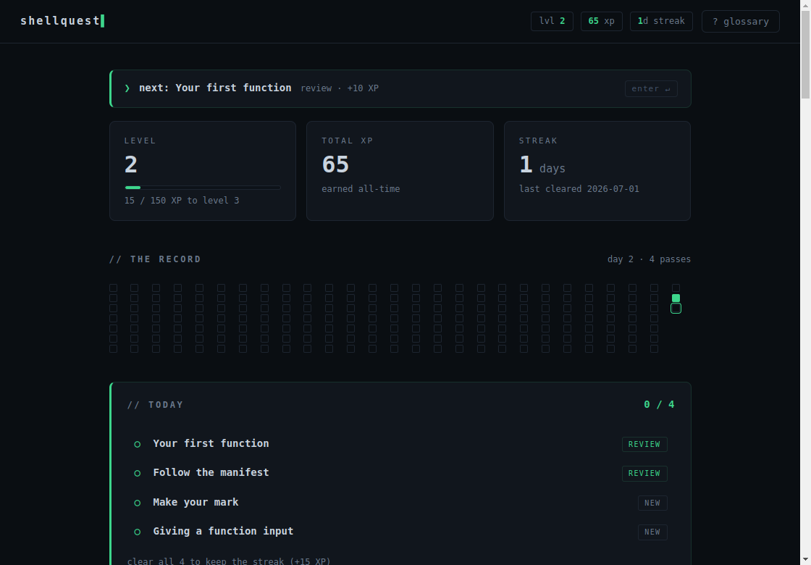
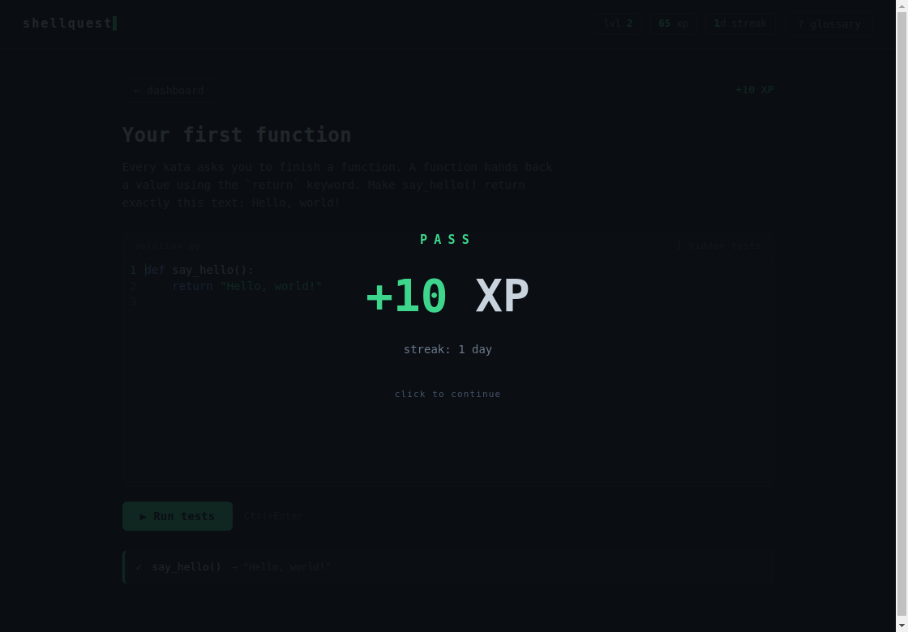

# shellquest▌

**A gamified, self-verifying platform that teaches Python and the Linux
terminal from absolute zero — with spaced-repetition reviews, a real
project you assemble piece by earned piece, and every bit of progress
documented in public as git history.**

One repository is simultaneously the app, the curriculum, the save file,
the backup, and the public journal. Every exercise you pass becomes a
commit; the contribution graph *is* the streak.





## Quick start

```bash
git clone https://github.com/tylerleonarddev/ShellQuest.git shellquest
cd shellquest
npm install
npm start
```

Needs Node 20+, Python 3, and git. First launch opens a one-step
onboarding that teaches the loop; the ladder takes over from there.

## The learning arc

- **Tier 0 — absolute zero.** Plain-English lesson cards interleaved with
  one-idea katas: functions, returns, strings, conditionals. The prompt is
  the lesson; the first win takes two minutes.
- **Tiers 1–4 — the climb.** Strings and loops to dicts, recursion, binary
  search, and sorting — the fundamentals CS coursework assumes.
- **Data structures.** Build your own Stack, Queue, linked list, and BST,
  driven by multi-step tests.
- **The terminal track.** Real flag-hunt challenges done in a real
  terminal, verified by artifacts — not quizzes.
- **The project.** Each build-step kata you pass writes your verified
  function into a real, runnable log analyzer under `projects/` — finish
  the track and you've built a tool, not done homework.

Along the way: **FSRS spaced repetition** resurfaces what you've learned
right before you'd forget it, a daily queue keeps the habit honest, a
glossary defines every term before it's used, and failures speak plain
language, never raw tracebacks.

## Learning in public

Passing an exercise scaffolds a devlog draft (~70% pre-filled); one button
publishes and pushes it. A weekly digest writes itself. The
[live stats page](https://tylerleonarddev.github.io/ShellQuest/) is
regenerated from real progress data on every push.

## How it's built

Electron + vanilla JS, content as pure JSON data, git as the only
database, [`ts-fsrs`](https://github.com/open-spaced-repetition/ts-fsrs)
for scheduling. Progress is flat files — migrating machines is
`git clone`. The full design rationale lives in
[`docs/ARCHITECTURE.md`](docs/ARCHITECTURE.md), every build spec and
decision in [`docs/`](docs/), and the 0.1→1.0 story in
[`CHANGELOG.md`](CHANGELOG.md).

Built in the open, in a week, by one person and a pair of AI
collaborators — architecture by Opus, implementation by Claude Code
(Fable), every exercise adversarially validated before it shipped.

## License

MIT — see [LICENSE](LICENSE). Not accepting contributions yet; see
[CONTRIBUTING.md](CONTRIBUTING.md).
